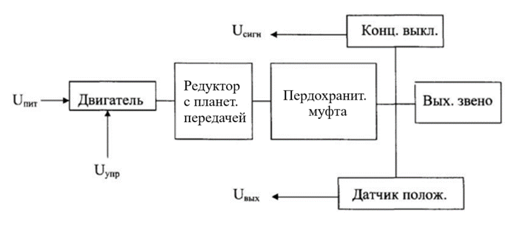

# **Рулевая Машина**
## КУРСОВАЯ РАБОТА

### **Введение**

<<<<<<< HEAD

Система управления современных самолетов вне зависимости от их класса и предназначения представляет собой комплекс взаимосвязанных и взаимодействующих систем. Качество и точность автоматической стабилизации движения летательного аппарата (ЛА) существенным образом зависит его элементов, одним из которых является Рулевая Машина (РМ). Рулевая машина служит для преобразования энергии (обычно электрической) в механическое перемещение выходного вала РМ в соответствии с сигналом управления. Рулевые машины широко используются в системах автоматического управления летательными аппаратами в качестве силового исполнительного электромеханического агрегата для перемещения рулей летательного аппарата и для их удержания в заданном положении.

Исходя из значимости вопросов управления летательными аппаратами, была поставлена задача разработки рулевой машины. Проведен анализ и обобщение требований, предъявляемых к рулевым машинам. Основные из них: высокая надежность, эффективность, долговечность и уменьшение массогабаритных характеристик. 

На стадии проектирования, были рассмотрены различные варианты реализации конструкции. Для электропривода могут использоваться как двигатели постоянного, так и двигатели переменного тока. Для проекта был выбран шаговый двигатель исходя из следующих характеристик: точность и стабильность шага, невысокая стоимость по сравнению с другими электродвигателями, легкость подключения и настройки, надежность, длительность срока эксплуатации и т.п. 

Для соосности и увеличения нагрузочной способности, передаточного числа и КПД при сравнительно малых габаритах в состав рулевой машины включен планетарный редуктор, устанавливаемый между двигателем и предохранительной муфтой.

### **Техническое Задание**

Область применения: В системах автоматического управления летательными аппаратами (ЛА) в качестве силового исполнительного электромеханического агрегата для перемещения рулей ЛА и для их удержания в заданном положении. 

Технические требования: Рулевая машина должна содержать элементы, указанные на структурной схеме (рис. 1). Технические параметры, конструктивные, технологические и другие требования - в соответствии с исходными данными. 

Стадии разработки: Техническое предложение, эскизный проект, технический и рабочий проекты - в соответствии с объёмом и графиком выполнения курсового проекта. 

Схема и краткое описание: Рулевая машина состоит из следующих основных узлов: электродвигателя, редуктора с предохранительной муфтой, элементов электрической схемы управления и выходного звена.

Приводным двигателем служит управляемый двигатель-генератор, от которого крутящий момент через редуктор передается на выходное звено, связанное непосредственно через кинематику или бустерное управление с соответствующим рулем летательного аппарата. Выходным звеном служит либо тросовый барабан, либо звездочка цепной передачи. Максимальный момент, развиваемый двигателем, ограничен муфтой пересиливания (предохранительной муфтой), встроенной в конструкцию редуктора. К элементам электрической 9 схемы управления относятся потенциометр обратной связи и концевые выключатели.

        
**Исходные данные для проектирования:**

*
*Скорость вращения выходного звена, град/сек ………………………...12; 
Максимальный момент на выходном звене, Н*м ….…………………...22; 
Угол поворота выходного звена , град ………….…………………… ±70; 
Тип муфты……………………………...………………………. кулачковая; 
Тип и размеры выходного звена…………… звездочка D = 80 мм, Z =13;*

- РМ работает от источников питания: 200 В частотой 400 Гц; 27 В постоянного тока; 
- ресурс безотказной работы - 2000 час. в течение 5 лет; 
- производство - серийное;
- исполнение - О2.1;
- условия хранения - 2У3; 
- мертвый ход выходного звена - не более 50 угл. минут; 
- транспортировка - любым видом транспорта; 
- в конструкторской документации должен быть предусмотрен контроль выходных механических параметров, сигнальных цепей, электрической прочности изоляции. 

**Содержание графической части:**

<<<<<<< HEAD

Кинематическая схема РМ …. 1 лист формата А2; 
Общий вид РМ ………………. 1 лист формата А1; 
Сборочный чертеж РМ ……… 1 лист формата А1; 
Габаритный чертеж ………….. 1 лист формата А2; 
Чертежи сб. ед. и деталей …… 2 листа формата А1.

=======
    Кинематическая схема РМ …. 1 лист формата А2;  
    Общий вид РМ ………………. 1 лист формата А1;  
    Сборочный чертеж РМ ……… 1 лист формата А1;  
    Габаритный чертеж ………….. 1 лист формата А2;  
    Чертежи сб. ед. и деталей …… 2 листа формата А1.
>>>>>>> a994f13f74023998afbd28fc3cf34bba1962d42a

*Кроме общих позиций расчетно-пояснительная записка должна содержать:*

   1.	Расчет предохранительной муфты;
   2.	Расчет мертвого хода выходного звена.